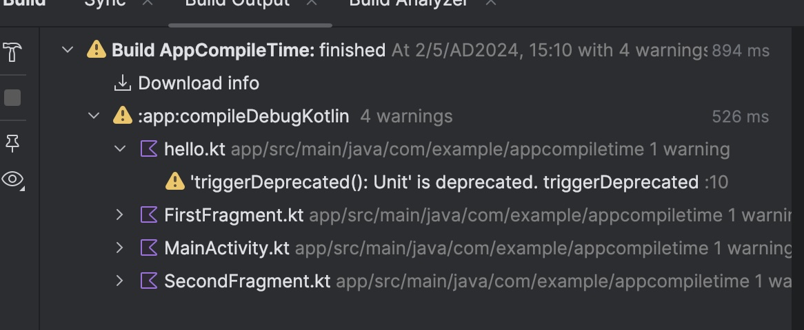

# 用 deprecated warning 來檢視被 compile 檔案數量
這個小專案有 1 個 Activity, 2 個 Fragments, 在裡面都任意安插呼叫標示成 deprecated 的 function。觀察 build log 可以看到哪些檔案被編譯

先編譯一次之後, 修改 MainActivity 裡面任意一行, 重新編譯, 當 `incremental = true`, 只有被修改到的 MainActivity 會被重新編譯

```
#gradle.properties
kotlin.incremental=true
```


改成 `kotlin.incremental=false` 的話


另外兩個沒修改的檔案也要重新編譯阿～

# ABI 改變造成連鎖效應

如果 function 的回傳形態發生改變, 那呼叫到的檔案也會重新 compile, 這很好理解

```
fun hello(): Int {
   triggerDeprecated()
   return Random.nextInt()
}

```

改成 return String, 

```
fun hello(): String {
    triggerDeprecated()
    return "1"
}
```
當然呼叫到的三個檔案, 跟 hello 自己都會重新編譯


BUT
那我回傳 data class 呢

```
data class World(
    val func1: String,
    val lambda2: Int
)
fun hello(): World {
    triggerDeprecated()
    return World("", 1)
}
```

一樣回傳 World, 但是新增一個欄位, 

```
data class World(
    val func1: String,
    val lambda2: Int,
    val funcOfFunc: String = "" // <-- 我只新增了這行
)
fun hello(): World {
    triggerDeprecated()
    return World("", 1)
}
```


### 回傳形態, 包含回傳 class 的內容形態改變, 都會影響到使用的檔案

如何改善

* 因為是在開發過程中, 可以一次把要新增的欄位加完再跑, 會比加一個參數跑一次還要省時間
* 拆分成小檔案, 如果 那三個 Fragment, Activity 檔案都有很多行, compiler 會只重新 compile 呼叫 `hello()` 這一行嗎？我想應該是不行的。把太大的檔案拆分, 應該可以減少編譯時間。
* 不要新增 lambda 到 data class 。 因為新增時候就會影響到所有用到 這個 data class, 但是不一定需要這個 lambda 的地方

